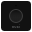

# NUKI Discovery  

[](https://nuki.io/de/)  

[]()  

Diese Instanz kann die mit dem NUKI Server verbundenen NUKI Bridges ermitteln. Es wird eine bestehende Internetverbindung benötigt.  

Für dieses Modul besteht kein Anspruch auf Fehlerfreiheit, Weiterentwicklung, sonstige Unterstützung oder Support.
Bevor dieses Modul installiert wird, sollte unbedingt ein Backup von IP-Symcon durchgeführt werden.
Der Entwickler haftet nicht für eventuell auftretende Datenverluste oder sonstige Schäden.
Der Nutzer stimmt den o.a. Bedingungen, sowie den Lizenzbedingungen ausdrücklich zu.

### Inhaltverzeichnis

1. [Funktionsumfang](#1-funktionsumfang)
2. [Voraussetzungen](#2-voraussetzungen)
3. [Software-Installation](#3-software-installation)
4. [Einrichten der Instanzen in IP-Symcon](#4-einrichten-der-instanzen-in-ip-symcon)
5. [Statusvariablen und Profile](#5-statusvariablen-und-profile)
6. [WebFront](#6-webfront)
7. [PHP-Befehlsreferenz](#7-php-befehlsreferenz)

### 1. Funktionsumfang

* Listet die mit dem NUKI Server verbundenen NUKI Bridges auf
* Automatisches Anlegen der ausgewählten NUKI Bridge

### 2. Voraussetzungen

- IP-Symcon ab Version 5.1
- NUKI Bridge
- Internetverbindung

### 3. Software-Installation

- Bei kommerzieller Nutzung (z.B. als Einrichter oder Integrator) wenden Sie sich bitte zunächst an den Autor.
  
- Bei privater Nutzung wird das Modul über den Modul Store installiert.

### 4. Einrichten der Instanzen in IP-Symcon

- In IP-Symcon an beliebiger Stelle `Instanz hinzufügen` auswählen und `NUKI Discovery` auswählen, welches unter dem Hersteller `NUKI` aufgeführt ist. Es wird eine NUKI Discovery Instanz unter der Kategorie `Discovery Instanzen` angelegt.  

__Konfigurationsseite__:

Name            | Beschreibung
--------------- | ---------------------------------
NUKI Bridges    | Liste die mit dem NUKI Server verbundenen NUKI Bridges auf

__Schaltflächen__:

Name            | Beschreibung
--------------- | ---------------------------------
Alle erstellen  | Erstellt für alle aufgelisteten NUKI Bridges jeweils eine Instanz
Erstellen       | Erstellt für die ausgewählte NUKI Bridge eine Instanz        

__Vorgehensweise__:

Über die Schaltfläche `AKTUALISIEREN` können Sie die Liste der verfügbaren NUKI Bridges jederzeit aktualisieren.  
Wählen Sie `ALLE ERSTELLEN` oder wählen Sie eine NUKI Bridge aus der Liste aus und drücken dann die Schaltfläche `ERSTELLEN`, um die NUKI Bridge automatisch anzulegen.  
Sobald die NUKI Bridge als Splitter Instanz erstellt wurde, nehmen Sie bitte die Konfiguration der NUKI Bridge vor.  
Ergänzen Sie zur bestehenden NUKI Bridge Konfiguration die Bridge ID und den API Token.  
Bei der Ersteinrichtung der NUKI Bridge mittels der NUKI iOS / Android App auf dem Smartphone wurden Ihnen die Daten angezeigt.  

### 5. Statusvariablen und Profile

Die Statusvariablen/Kategorien werden automatisch angelegt. Das Löschen einzelner kann zu Fehlfunktionen führen.

##### Statusvariablen

Es werden keine Statusvariablen angelegt.

##### Profile:

Nachfolgende Profile werden zusätzlichen hinzugefügt:

Es werden keine Profile angelegt.

### 6. WebFront

Der NUKI Configurator ist im WebFront nicht nutzbar.  

### 7. PHP-Befehlsreferenz

```text
Verbundene NUKI Bridges ermitteln: 

NUKI_DiscoverBridges(integer $InstanzID);  
Ermittelt die mit dem NUKI Server verbundenen NUKI Bridges.  
Die Funktion liefert ein Array der verbundenden NUKI Bridges als Rückgabewert.  

Beispiel:  
$bridges = NUKI_DiscoverBridges(12345); print_r($bridges);
```