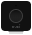

# NUKI Opener

[](https://nuki.io/de/)  

[]()  

Dieses Modul integriert den [NUKI Opener](https://nuki.io/de/opener) in [IP-Symcon](https://www.symcon.de). 
In Verbindung mit einer NUKI Bridge macht der Nuki Opener aus deiner bestehenden Gegensprechanlage einen smarten Türöffner.  

Für dieses Modul besteht kein Anspruch auf Fehlerfreiheit, Weiterentwicklung, sonstige Unterstützung oder Support.

Bevor das Modul installiert wird, sollte unbedingt ein Backup von IP-Symcon durchgeführt werden.

Der Entwickler haftet nicht für eventuell auftretende Datenverluste oder sonstige Schäden.

Der Nutzer stimmt den o.a. Bedingungen, sowie den Lizenzbedingungen ausdrücklich zu.

### Inhaltverzeichnis

1. [Funktionsumfang](#1-funktionsumfang)
2. [Voraussetzungen](#2-voraussetzungen)
3. [Software-Installation](#3-software-installation)
4. [Einrichten der Instanzen in IP-Symcon](#4-einrichten-der-instanzen-in-ip-symcon)
5. [Statusvariablen und Profile](#5-statusvariablen-und-profile)
6. [WebFront](#6-webfront)
7. [PHP-Befehlsreferenz](#7-php-befehlsreferenz)

### 1. Funktionsumfang

* Betätigen des Türsummers

### 2. Voraussetzungen

- IP-Symcon ab Version 5.1
- NUKI Bridge
- NUKI Opener

### 3. Software-Installation

- Bei kommerzieller Nutzung (z.B. als Einrichter oder Integrator) wenden Sie sich bitte zunächst an den Autor.
  
- Bei privater Nutzung wird das Modul über den Modul Store installiert.

- Sofern noch keine NUKI Bridge Instanz in IP-Symcon vorhanden ist, so beginnen Sie mit der Installation der NUKI Discovery Instanz.  
Hier finden Sie die [Dokumentation](../Discovery) zum NUKI Discovery.  
Alternativ können Sie die NUKI Bridge auch manuell anlegen. Hier finden Sie die [Dokumentation](../Bridge) zur NUKI Bridge.

- Sofern noch keine NUKI Configurator Instanz in IP-Symcon vorhanden ist, so beginnen Sie mit der Installation und Konfiguration der NUKI Configurator Instanz.  
Hier finden Sie die [Dokumentation](../Configurator) zum NUKI Configurator.  
Alternativ könenn Sie den NUKI Opener auch manuell anlegen. Lesen Sie bitte dafür diese Dokumentation weiter durch.

### 4. Einrichten der Instanzen in IP-Symcon

- In IP-Symcon an beliebiger Stelle `Instanz hinzufügen` auswählen und `NUKI Opener` auswählen, welches unter dem Hersteller `NUKI` aufgeführt ist. Es wird eine NUKI Opener Instanz angelegt, in der die Eigenschaften zur Steuerung des NUKI Openers gesetzt werden können.

__Konfigurationsseite__:

Name                                | Beschreibung
----------------------------------- | ------------------------------
(0) Instanzinformationen            | Informationen zum NUKI Opener
(1) Opener                          | Eigenschaften des NUKI Openers

__Schaltflächen im Aktionsbereich__:

Name                                | Beschreibung
----------------------------------- | ----------------------------------------------
(1) Opener                          | 
Aktuellen Status anzeigen           | Zeigt den aktuellen Status des NUKI Openers an
Ring to Open deaktivieren           | Deaktiviert die Ring to Open Funktion
Ring to Open aktivieren             | Aktiviert die Ring to Open Funktion
Dauermodus deaktivieren             | Deaktiviert den Dauermodus
Dauermodus aktivieren               | Aktiviert den Dauermodus
Türsummer betätigen                 | Betaätigt den Türsummer, um die Tür zu öffnen

__Vorgehensweise__:  

Geben Sie bei manueller Konfiguration die NUKI ID und einen Namen für den NUKI Opener an. 

### 5. Statusvariablen und Profile

Die Statusvariablen/Kategorien werden automatisch angelegt. Das Löschen einzelner kann zu Fehlfunktionen führen.

##### Statusvariablen

Name                    | Typ       | Beschreibung
----------------------- | --------- | ----------------
DoorBuzzer              | Integer   | Türsummer
OpenerMode              | String    | Modus des NUKI Openers
OpenerState             | String    | Status des NUKI Openers
BatteryState            | Boolean   | Batteriestatus

##### Profile:

Nachfolgende Profile werden zusätzlichen hinzugefügt:

NUKI.InstanzID.DoorBuzzer

Wird die NUKI Opener Instanz gelöscht, so werden automatisch die oben aufgeführten Profile gelöscht.

### 6. WebFront

Über das WebFront kann der Türsummer zum öffnen der Tür betätigen werden. Informationen über den Modus, Status und den Batteriestatus werden angezeigt.
 
### 7. PHP-Befehlsreferenz

```text
Status aktualisieren:  

NUKI_GetOpenerState(integer $InstanzID);  
Fragt den aktuellen Status des NUKI Openers ab und aktualisiert die Werte der entsprechenden Variablen.  
Rückgabewert: Die aktuellen Werte als String  

Beispiel:  
$state = NUKI_GetOpenerState(12345);
```

```text
Türsummer betätigen:  

NUKI_BuzzDoor(integer $InstanzID);  
Betätigt den Türsummer, um die Tür zu öffnen.  
Rückgabewert: Gibt true oder false zurück  

Beispiel:  
$actuate = NUKI_BuzzDoor(12345);
```  

```text
Ring to Open de-/aktivieren:  

Mit der Ring to Open Funktion wird der Buzzer deiner Gegensprechanlage betätigt, sobald jemand an der Haustür deines Wohngebäudes klingelt. Dein Smartphone wird erkannt, sobald du in der Nähe bist.  

NUKI_ToggleRingToOpen(integer $InstanzID, boolean $Status);  
De-/Aktiviert die Ring to Open Funktion.
$Status: false = deaktivieren, true = aktivieren    
Rückgabewert: Gibt true oder false zurück  

Beispiel:  
Deaktivieren:   $toggle = NUKI_ToggleRingToOpen(12345, false);
Aktivieren:     $toggle = NUKI_ToggleRingToOpen(12345, true);
```  

```text
Dauermodus de-/aktivieren:  

Wenn du den Dauermodus aktivierst, öffnet der Nuki Opener immer automatisch die Haustür, sobald jemand bei dir klingelt. Du kannst diese Funktion jederzeit deaktivieren.  

NUKI_ToggleContinuousMode(integer $InstanzID, boolean $Status);  
De-/Aktiviert den Dauermodus.
$Status: false = deaktivieren, true = aktivieren    
Rückgabewert: Gibt true oder false zurück  

Beispiel:  
Deaktivieren:   $toggle = NUKI_ToggleContinuousMode(12345, false);
Aktivieren:     $toggle = NUKI_ToggleContinuousMode(12345, true);
``` 